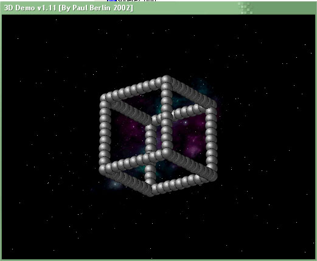



## Demo 1\.11 3D

### Description

This is a 3D demo showing several different static and animated shapes rotating in front of an starfield. It also plays some cool mod music. All the shapes are built with 2D spheres. All 3D calculations are done in pure vb. It requires Windows 2k, XP or better because it is using TransparentBlt. On my Athlon 1,2Ghz it runs at 100fps. Make sure you read 'important info.txt'.
 
### More Info
 

             |
---                |---
**Submitted On**   |2003-07-06 03:26:58
**By**             |[Paul Berlin](https://github.com/Planet-Source-Code/PSCIndex/blob/master/ByAuthor/paul-berlin.md)
**Level**          |Advanced
**User Rating**    |4.5 (18 globes from 4 users)
**Compatibility**  |VB 6\.0
**Category**       |[Graphics](https://github.com/Planet-Source-Code/PSCIndex/blob/master/ByCategory/graphics__1-46.md)
**World**          |[Visual Basic](https://github.com/Planet-Source-Code/PSCIndex/blob/master/ByWorld/visual-basic.md)
**Archive File**   |[Demo\_1\_11\_1613317122003\.zip](https://github.com/Planet-Source-Code/paul-berlin-demo-1-11-3d__1-46841/archive/master.zip)

